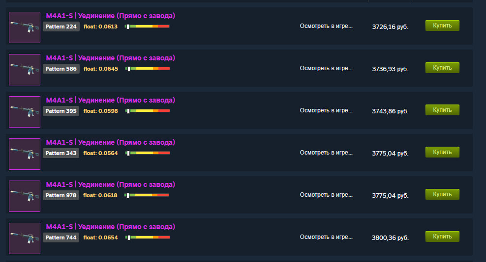

# Steam Pattern & Float Checker

## Инструкция на русском

**Что делает расширение:**

Это расширение автоматически показывает важную информацию о скинах на Steam Market:
- Номер паттерна (pattern) каждого скина
- Значение износа (float)
- Визуальную полосу износа
- Подсвечивает указанный pattern

Больше не нужно открывать сайты проверки — вся информация отображается прямо на странице маркета!

**Как установить:**

1. Откройте Chrome → Меню → Дополнительные инструменты → Расширения
2. Включите "Режим разработчика" (кнопка в правом верхнем углу)
3. Нажмите "Загрузить распакованное расширение" и выберите папку `pattern finder`
4. Готово! Расширение начнёт работать на Steam Market

---

## Instructions in English

**What this extension does:**

This extension automatically displays important information about skins on Steam Market:
- Pattern number of each skin
- Float value (wear)
- Visual wear bar

No more need to open third-party checker websites — all the information appears right on the market page!

**How to install:**

1. Open Chrome → Menu → More tools → Extensions
2. Enable "Developer mode" (button in the top right corner)
3. Click "Load unpacked" and select the `pattern finder` folder
4. Done! The extension will start working on Steam Market

---

## 中文说明

**此扩展的功能:**

此扩展可自动显示 Steam Market 上皮肤的重要信息:
- 每个皮肤的花纹编号 (pattern)
- 磨损值 (float)
- 可视磨损条
- 突出显示指定的花纹

无需再打开第三方检查网站 — 所有信息都直接显示在市场页面上!

**如何安装:**

1. 打开 Chrome → 菜单 → 更多工具 → 扩展程序
2. 启用"开发者模式"(右上角的按钮)
3. 点击"加载未打包的扩展程序"并选择 `pattern finder` 文件夹
4. 完成! 扩展程序将在 Steam Market 上开始工作

## Support the project
If you like what I do, you can support me here: [Donate](https://dalink.to/memesold)  
Thanks a lot! 🙏

